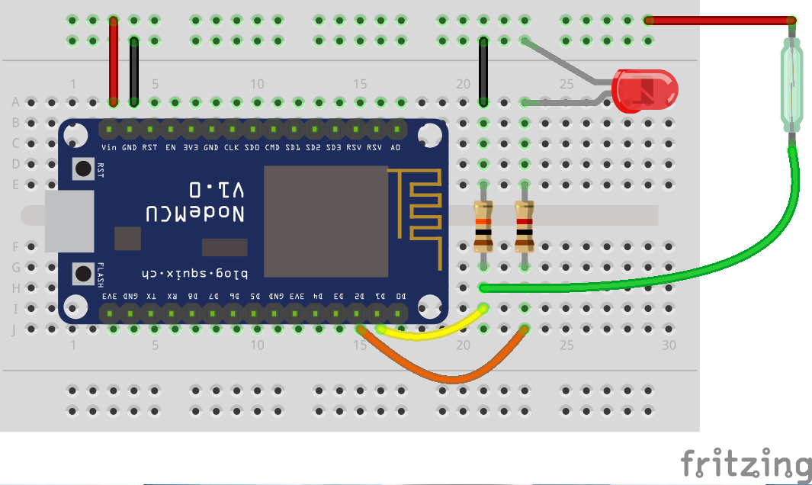

# Pulse counter with ESP8266 #

This simple sketch detects magnetic pulse thanks to a reed switch, and sends it immediately to a [Domoticz](http://domoticz.com/) instance AND an MQTT broker.

It is used with a Kent V100 (PSM) water meter, which is heavily used in Belgium.  It generates one pulse per 0.5 liter.

The hardware schematic is quite simple:





Digital input D1 is set to ground thanks to a pull down resistor R2.  When the reed switch is closed, the input is raised to VCC and an interrupt is detected.  The LED1 is flashing to provide a visual control when a pulse is detected.

## MQTT ##
Initially, the sketch was foreseen to Domoticz only.  But MQTT has been added in order to use Grafana & InfluxDB as database and visualization tool, allowing greater flexibility in the aggregation and custom made dashboards.

The following topics are defined (*my_hostname* is the ESP chipID (aka serial number) of the ESP8266):

1. house/hardware/ping_all
  * *Direction*: get
  * *answer*: house/hardware/ping_all/result: hostname of the ESP.
  * *Usage*:

    Specific topic that all hardware on the network must listen to and answer.
    It's a kind of discovery topic to have a view on active hardware.


2. house/hardware/my_hostname/do_reboot
  * *Direction*: set
  * *answer*: none
  * *payload*: none
  * *Usage*:

    Restart the ESP. It does not work after the first restart after serial flashing.
    However it works after manual reboot by power of RST switch.


3. house/hardware/my_hostname/do_upgrade
  * *direction*: set
  * *answer*: none
  * *payload*: the URL to download the firmware.
  * *Usage*:

     Launch firmware upgrade via HTTP download.  The payload is the HTTP URL to download the firmware.
     ! A priori, only HTTP works (no HTTPS)!


4. house/hardware/my_hostname/enable_mqtt_logs
  * *direction*: set
  * *answer*: none
  * *payload*: 0 --> disable log. Any other char --> enable logs
  * *usage*: Enable of disable MQTT verbose logs. Those are sent on house/hardware/my_hostname/log


5. house/hardware/my_hostname/get_config
  * *direction*: get
  * *answer*: Send on the log topic the following info: sensor topic, file compilation date and time, Wifi ssid
  * *payload*: none
  * *usage*: return some configuration and state information's


6. house/hardware/my_hostname/ctrl_led
    * *direction*: set
    * *answer*: none
    * *payload*: 0 -->Turn LED off.  Any other char --> turn the LED on.
    * *usage*: Test MQTT messaging by controlling builtin LED.


The device is reporting pulses (aka. water volume consumption in liter) on the topic **/house/sensors/water/city**. This value is configurable in the `private.h` file.


## Compilation ##

Before compiling, create a `private.h` file based on the provided `private_example.h` file: it should contain your Wifi settings, as well as the Domoticz parameters.  The `domoticz_counter_idx` parameter refers to the ID of the "incremental counter" created in Domoticz.

You could choose if you want Domoticz and/or MQTT backend activated. To do so, (un)define the relevant constants at the beginning of the `pulse_counter_ESP8266.ino` file:

```
#define DOMOTICZ
#define MQTT
```

The code contains a lot of debug statements. If those are not required, comment the `#define DEBUG` at the beginning of the main file.
